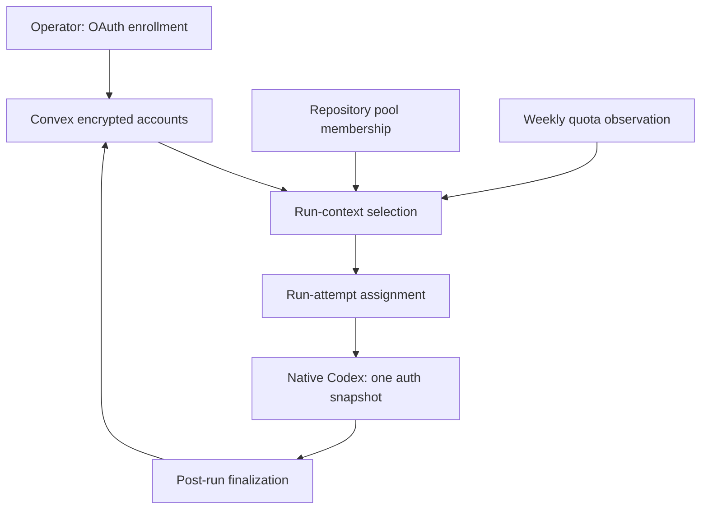
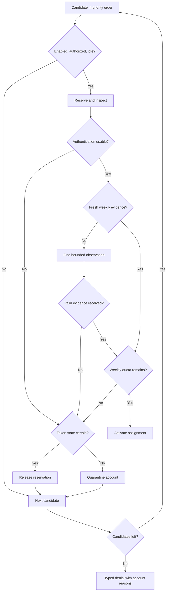

# Codex Subscription Pool - Plan

## Goal Capsule

- **Objective:** Let prfrog use two Codex subscriptions automatically, choosing an available account before each run when the other has reached its weekly limit.
- **Means:** Add a named account pool to the existing Convex backend and keep the native Codex harness.
- **Authority:** Product requirements govern behavior; technical decisions govern mechanisms; implementation units describe delivery. Later user instructions override this plan.
- **Completion:** Reviewed implementation and companion consumer PRs, passing verification, and a documented activation procedure. Production enrollment, activation, and live canaries require execution-time authorization; this planning request changes no runtime behavior.
- **Stop conditions:** Do not activate if account identity cannot be established, credential ownership cannot be protected, or the pinned runtime fails the compatibility checks below.

---

## Product Contract

### Summary

Store two separately named Codex accounts, inspect their weekly availability, and assign one account to each new run. Keep that assignment until the run finishes and save refreshed credentials back to the same account. Show why an account was selected or why no run could start.

### Problem Frame

Pullfrog currently resolves one `CODEX_AUTH_JSON` secret for a repository. When its subscription is exhausted, there is no automatic selection of another subscription. A second secret alone is insufficient: concurrent runners can rotate tokens, and current write-back resolves the destination again rather than remembering which credential the run received.

### Requirements

**Accounts and selection**

- R1. An authorized operator can enroll, replace, enable, disable, and inspect named Codex accounts without exposing tokens in normal output.
- R2. A repository can opt into an ordered pool of enrolled accounts; the initial deployment uses two accounts and preserves repository/owner access boundaries.
- R3. New runs select the first enabled, authenticated, idle account with fresh evidence of remaining weekly quota. Weekly identification uses the declared window duration, wherever the provider places it; a five-hour window is not required.
- R4. Selection distinguishes quota exhaustion, busy accounts, invalid authentication, missing configuration, and unavailable quota evidence. A denied run stops before invoking an agent, reports a useful reason and known retry/reset time, and never silently falls back to API billing.

**Credential ownership**

- R5. One account serves at most one active native run across the pool's repositories. A repeated startup request for the same verified run attempt returns its existing assignment.
- R6. A run receives only its selected account's credentials. All token updates remain tied to that account and credential generation; stale runs cannot overwrite replacement credentials or another account.
- R7. Completion, startup failure, cancellation, and lost cleanup have defined recovery paths. Uncertain token state prevents reassignment until repaired.

**Compatibility and visibility**

- R8. Pool-disabled repositories retain the existing single-secret behavior. Pool-enabled repositories require a compatible runtime and reject ambiguous externally supplied Codex credentials.
- R9. Authenticated account status shows weekly usage, reset time, observation age, availability, and active assignment. Run records show a safe account label and selection outcome; public output excludes emails, provider identity, and secrets.
- R10. An already running task stays on its assigned account. If it exhausts quota, its ordinary failure/partial-work result is retained; this release neither switches it mid-session nor automatically replays its actions.

### Acceptance Examples

| Example | Situation | Expected outcome | Covers |
|---|---|---|---|
| AE1 | Primary is at 100%; secondary has weekly quota | New run uses secondary | R3 |
| AE2 | Weekly quota is in the provider's primary window; no secondary quota window exists | Selection still works | R3 |
| AE3 | Primary reports 99.6% used | It is not classified as exhausted by rounding | R3 |
| AE4 | Both accounts have active runs | No third native process starts; result says busy | R4, R5 |
| AE5 | Both accounts are exhausted | Result includes earliest known reset; no API fallback | R4 |
| AE6 | A delayed run writes after account replacement | Write is rejected without changing either account | R6 |
| AE7 | Post cleanup never arrives | Assignment is reconciled; uncertain credentials stay unavailable | R7 |
| AE8 | Pool disabled with the existing secret | Existing single-account startup still works | R8 |

### Scope Boundaries

The first version covers native Codex subscription runs, operator enrollment through the CLI, and status in the existing credentials page. OAuth consent stays human-controlled; coding agents receive no account-management tools.

### Deferred to Follow-Up Work

Mid-run switching/resume, a persistent proxy, concurrent native runs sharing one credential chain, cross-owner account sharing, and pooled OpenCode authentication are separate work. The initial release does not add a queue that waits until a weekly reset.

---

## Planning Contract

### Current Code and Integration Points

Baseline: `ecrofaidem/pullfrog` main at `57d8e9f536e6a88cc0ded310f7b4d8f02ab3af2b`, inspected on September 12, 2026.

- `server/convex/handlers/runContext.ts` loads visible secrets and refreshes the exact `CODEX_AUTH_JSON` name before handing credentials to the action.
- `server/convex/secrets.ts` has a short refresh lease, but completion/release/rejection writes lack an ownership fence. `server/convex/handlers/runtimeSecret.ts` re-resolves the destination at write-back.
- `server/convex/usage.ts` already stores usage and has scheduled refresh. Both it and `utils/codexUsage.ts` currently choose the longest window and round percentages, which is unsuitable for routing.
- `main.ts` preserves pre-existing environment secrets. `utils/runContext.ts` can fall back to defaults after context failures; pool denials must survive both behaviors.
- `entryPost.ts` and `utils/oauthWriteback.ts` handle post-run credentials. Unchanged authentication currently produces no write-back request, so assignment finalization needs its own operation.
- `FORK.md` requires consumers to pin the fork SHA and set `PULLFROG_FORCE_LOCAL_CLI: "1"`; otherwise the published CLI can bypass these runtime changes.

### Key Technical Decisions

- KTD1. **Extend Convex and retain native Codex.** (session-settled: user-approved — chosen over adding a proxy: the existing backend already owns encrypted credentials and run startup.) This implements R2 and R6 with fewer new runtime boundaries. Borrow small policy/test ideas from `codex-multi-auth`; do not import its internal rotation runtime as a library.
- KTD2. **Separate credential identity from pool membership.** Add a canonical owner-scoped Codex account record with encrypted auth, stable ID, label, provider identity, generation, and health. Repository pool configuration references those records in priority order. Deduplicate provider identity within the owner so enrolling the same subscription twice cannot bypass R5. Repo-scoped credentials remain usable only by their repository; an owner-scoped account requires explicit pool membership.
- KTD3. **Use raw weekly observations.** Normalize the provider response through one pure parser shared by server selection and runtime display. Match 604800 seconds/10080 minutes, preserve the raw percentage, and round only at rendering. Reject non-finite percentages, missing/reset-invalid weekly data, and unsupported shapes as unknown. An observation is fresh for 60 seconds and only for its credential generation; crossing its reset invalidates it rather than assuming zero usage. Refresh stale/unknown data once within a 20-second total preflight deadline. After a quota failure, refresh evidence before another assignment. Honor explicit provider denial signals without classifying every 429 as weekly exhaustion. Governs the mechanism for R3 and R4.
- KTD4. **Reserve before handing out a credential.** Use a separate assignment table keyed by OIDC-verified repository, run ID, and run attempt; the existing mutable run-status row is not the ownership record. Bind it to a runtime-instance nonce persisted before the request: retries by that instance reuse the assignment, while a second action instance in the same attempt is rejected. Reserve a candidate atomically, refresh/check quota while reserved, then recheck generation, enabled state, membership, and quota before activation. Provider HTTP calls happen outside mutations. Convex transaction retries protect internal state, not external OAuth effects.
- KTD5. **Hold exclusive ownership for the native run.** Bind every refresh, rejection, release, usage update, and final write to account ID, generation, and an unguessable ownership token. The server/cron must not refresh a chain owned by a runner. Heartbeats identify suspected orphans but do not authorize reassignment. A lost response from an OAuth refresh may already have rotated the token; quarantine that chain instead of blindly retrying the old refresh token. R5 deliberately limits a two-account pool to two active runs.
- KTD6. **Finalize credentials before releasing ownership.** Persist assignment cleanup state as soon as startup receives a reservation, before credential installation or model introspection. Extend the existing `oauth_writeback` state and post bootstrap gate so cleanup also runs before harness-specific registration and when auth is unchanged. Finalization sends the last complete auth snapshot, or an explicit unchanged result, after the native child has stopped. Validate provider identity and compare generation/ownership before atomically storing and releasing. Duplicate finalization acknowledges the prior result. Reconcile every nonterminal assignment, including abandoned preflight and lost startup responses, using durable refresh/handoff progress. Release a preflight only when no handoff or uncertain rotation could have occurred. Otherwise require GitHub terminal evidence for the same run attempt; neither the existing stale-run timeout nor heartbeat expiry is terminal proof. An unconfirmed last token state requires reenrollment. Applies to R6 and R7.
- KTD7. **Version the pool runtime contract.** Configure `PULLFROG_CODEX_POOL_REQUIRED=1` in the consumer before requesting context, so timeout, malformed responses, and transport errors also stop before agent startup. The runtime advertises pool support and receives an assignment capability scoped to its run attempt; an old runtime cannot acquire a pooled account. Pool denials are typed startup failures and cannot continue with defaults. An existing workflow/local `CODEX_AUTH_JSON` or conflicting credential fallback causes a configuration error in pool mode; the selected credential must be the one actually installed. Preserve legacy requests and writes only on the pool-disabled path without the required-pool flag. Implements R4 and R8.
- KTD8. **Keep management and execution authority distinct.** Extend `/api/cli/secrets` with an optional named-account operation; retain unnamed legacy requests rather than assuming `/api/cli/credentials` exists. Reuse authenticated GitHub operator identity, require repository management permission for repo-scoped records, and owner administration permission to grant owner-account membership across repositories. The run capability permits only heartbeat/finalization and its selected credential's updates; it cannot list other accounts or change membership. Reenrollment advances generation and rejects all older writes, but preserves occupancy until the previous execution stops or its exact attempt is terminal. Disabling prevents new assignment while allowing the current run to finalize. Labels exposed in public run output are generated neutral aliases; operator labels remain private. Implements R1 and R9.

### High-Level Technical Design

The component/data flow follows KTD2, KTD4, and KTD7:



Startup and completion follow KTD4-KTD6:

```mermaid
sequenceDiagram
  participant R as Actions runtime
  participant C as Convex
  participant O as Codex auth and usage
  R->>C: OIDC, run attempt, pool capability
  C->>C: Reserve eligible candidate atomically
  C->>O: Refresh if needed; inspect weekly quota
  C->>C: Validate reservation and activate assignment
  C-->>R: Selected auth and scoped assignment capability
  R->>R: Persist cleanup state; run native Codex
  R->>C: Final snapshot or unchanged; child stopped
  C->>C: Fenced commit and release
  C-->>R: Idempotent finalization receipt
```

The assignment lifecycle implements R7; account authentication and weekly quota remain separate from assignment state:

```mermaid
stateDiagram-v2
  [*] --> Reserved
  Reserved --> Active: Preflight accepted
  Reserved --> Released: Safe failure before handoff
  Reserved --> Quarantined: Refresh outcome uncertain
  Active --> Finalizing: Child stopped
  Finalizing --> Released: Credential commit acknowledged
  Active --> Suspect: Heartbeat or cleanup missing
  Suspect --> Finalizing: Valid finalization arrives
  Suspect --> Quarantined: Terminal run; token state unknown
  Quarantined --> Released: Operator reenrolls safely
```



Selection applies R3-R4 without inventing capacity from unknown evidence:



### Assumptions and Operational Tradeoffs

The accounts are dedicated to this automation while enrolled: another desktop or CI client refreshing the same chain is outside Convex's ownership control. Enrollment must obtain separate authorization rather than copy an actively used desktop auth file. Provider behavior can still invalidate a chain; that becomes an authentication failure requiring repair.

Preflight chooses available capacity; it cannot promise that the remaining weekly quota will finish an arbitrarily long task. Both-busy returns promptly after the bounded preflight deadline; it does not create a durable queue. Unknown quota can temporarily reduce availability, but never becomes fabricated headroom.

The usage endpoint is an existing integration with an external contract that may change. Capture redacted response fixtures against the pinned Codex version during implementation. Do not probe live accounts while merely writing this plan.

### Rollout and Rollback

1. Land backend/schema support with every pool disabled. Retain existing API routes and single-account tests.
2. Land the compatible action and operator CLI; verify the packaged CLI actually calls the deployed management routes. Do not assume the latest npm release matches this fork.
3. Pin the tested action SHA in `ecrofaidem/monorepo` at `.github/workflows/pullfrog.yml`, retaining `API_URL` and `PULLFROG_FORCE_LOCAL_CLI`. Verify the installed runtime identifies that SHA.
4. At authorized activation, pause new subscription dispatch and drain legacy runs across all affected scopes. Enroll two distinct accounts and check identity and weekly observations. Set the consumer's required-pool flag and enable the pool for monorepo before resuming dispatch.
5. Run the canaries in the Verification Contract, then resume normal dispatch. Watch assignment, denial, refresh-conflict, and quarantine events with sanitized metadata.
6. To roll back, stop new pooled assignments and drain active runs. Restore one operator-selected current credential to the legacy secret destination, verify its health, then disable pool mode and remove the required-pool flag before resuming. Never restore a pre-rotation token backup. Do not delete account or assignment records during the rollout.

### Sources and Reuse

Use [codex-multi-auth's quota readiness policy](https://github.com/ndycode/codex-multi-auth/blob/f71768223f8cc5d9375b115046b624ce49e7db55/lib/quota-readiness.ts) as a reference for raw percentages and expired observations. Its local locks do not supply distributed run ownership. Any copied MIT source/test material retains its license notice.

Use [codexctl's profile handling](https://github.com/Sawmills/codexctl/blob/fba4c6b5bf46d6b9fa091fbb96441457b479f6d5/src/profile.rs) as a reference for identity-aware token write-back, not as a runtime dependency. Keep the existing TypeScript harness rather than wrapping it in another CLI.

Use [Convex's transaction guarantees](https://docs.convex.dev/database/advanced/occ) for assignment acquisition and fenced commits. They do not make OAuth network calls transactional.

---

## Implementation Units

### U1. Account records and fenced credential storage

**Goal:** Establish account identity and mutation ownership before adding selection. **Requirements:** R1, R2, R5, R6. **Dependencies:** None.

**Files:** `server/convex/schema.ts`, `server/convex/secrets.ts`, `server/convex/lib/codexRefresh.ts`; new `server/convex/codexAccounts.ts`, `server/tests/codexAccounts.test.ts`, `server/tests/codexRefresh.test.ts`.

**Approach:** Implement KTD2 and KTD5 using the existing encryption helpers. Add generation/ownership checks to every mutation of pooled credentials. Characterize legacy refresh behavior before changing shared code.

**Test scenarios:**

- Duplicate provider identity in one owner is rejected even across repository memberships.
- An unauthorized repository cannot read or assign an owner account without membership.
- A delayed refresh success, rejection, or lease release cannot modify a new generation or clear another owner's reservation.
- A refresh timeout after sending the request quarantines the uncertain chain; a definite pre-send failure releases it safely.
- Reenrollment and disablement follow KTD8, including a still-running prior generation.

**Verification:** Convex integration tests prove cross-account isolation and stale-write rejection; legacy single-secret tests remain valid.

### U2. Weekly observations and deterministic selection policy

**Goal:** Identify weekly capacity without rounding or stale-state errors. **Requirements:** R3, R4. **Dependencies:** U1.

**Files:** `server/convex/usage.ts`, `server/convex/crons.ts`, `utils/codexUsage.ts`; new `utils/codexQuota.ts`, `utils/codexQuota.test.ts`, `server/tests/codexUsage.test.ts`.

**Approach:** Implement KTD3 with a shared environment-independent parser. Cache observations per account generation. Scheduled reads must respect KTD5 and never rotate a runner-owned credential.

**Test scenarios:**

- Covers AE1-AE3: weekly data in either slot, a lone weekly window, 99.6%, and exactly 100%.
- Missing, malformed, non-finite, stale, and reset-crossed observations never count as available.
- A delayed observation from a replaced credential generation is discarded.
- Auth rejection, generic 429, provider denial, timeout, and exhausted weekly quota produce distinct reasons.
- Fresh cached data avoids another provider read; stale data uses one bounded probe.

**Verification:** One fixture set drives both selection and display; rounding cannot change routing decisions.

### U3. Run assignment and startup contract

**Goal:** Make selection atomic and denial impossible to ignore. **Requirements:** R2-R6, R8. **Dependencies:** U1, U2.

**Files:** `server/convex/handlers/runContext.ts`, `server/convex/lib/oidc.ts`, `server/convex/lib/runToken.ts`, `server/convex/http.ts`, `utils/runContext.ts`, `utils/runContextData.ts`, `main.ts`; new `server/convex/codexAssignments.ts`, `server/tests/codexAssignments.test.ts`, `server/tests/runContext.test.ts`, `utils/runContext.test.ts`.

**Approach:** Implement KTD4 and KTD7. Extend verified OIDC identity to run attempts and propagate the scoped capability without placing it in prompts. Store assignment identity before exposing auth to native setup. Exclude account-pool records from generic visible-secret enumeration, and reject pool startup for unsupported harnesses. In pool mode, bypass the current OpenCode auth installation/model introspection in `main.ts`; only native Codex may consume the selected chain.

**Test scenarios:**

- Covers AE4-AE5: three simultaneous requests produce at most two native assignments; all-exhausted produces a denial.
- Duplicate requests from the same runtime instance reuse one reservation; a second instance is rejected and a new attempt cannot take a still-owned account.
- A membership removal, disablement, or replacement between reservation and activation prevents handoff.
- Invalid OIDC, repository mismatch, forged attempt, and capability replay cannot access another assignment.
- Pool denial cannot become defaults, API-key fallback, or another harness invocation.
- Required-pool startup stops on timeout, 5xx, invalid JSON, and response loss after assignment activation; nonce retry recovers the existing assignment.
- Covers AE8: old/new clients against pool-disabled mode work; old clients against enabled pools fail explicitly.
- External `CODEX_AUTH_JSON` in pool mode produces a configuration failure and safely finalizes any reservation.
- Native pool startup never writes selected credentials to OpenCode auth storage or invokes OpenCode model discovery.

**Verification:** A signed startup request reaches the real handler and runtime decoder with exactly one account; no-agent paths are asserted end to end.

### U4. Native lifecycle, write-back, and orphan recovery

**Goal:** Finish or recover every acquired assignment safely. **Requirements:** R5-R8, R10. **Dependencies:** U3.

**Files:** `entry.ts`, `entryPost.ts`, `entryPost.stdlibOnly.test.ts`, `commands/gha.ts`, `agents/codex.ts`, `utils/oauthWriteback.ts`, `server/convex/handlers/runtimeSecret.ts`, `server/convex/codexAssignments.ts`, `server/convex/crons.ts`; new `utils/oauthWriteback.test.ts`, `server/tests/codexFinalization.test.ts`.

**Approach:** Implement KTD5-KTD6 across main/post action state and server reconciliation. Keep the post entrypoint's existing minimal dependency boundary. Detect a completed auth-file update atomically; never upload a partially written file. Treat explicit quota failure as telemetry for the next preflight, preserving the current run's result per R10.

**Test scenarios:**

- A refreshed snapshot updates only the assigned account; unchanged auth still releases ownership.
- Covers AE6: replacement during execution fences stale finalization, including a late rejection report.
- Duplicate finalization returns the same receipt without a second update.
- Cancellation before native startup, normal exit, agent failure, timeout, malformed auth, and post network failure each leave a defined assignment state.
- Covers AE7: heartbeat loss alone never reassigns; terminal run plus unknown token state requires repair.
- Abandoned preflight and lost handoff responses are reconciled without replaying OAuth or assuming tokens were never returned.
- A child that is still alive cannot be released by a premature finalization path.
- A mid-run quota error causes no replay or account switch.

**Verification:** Exercise real temporary auth files and main/post state transfer with mocked provider/GitHub responses; finalization works without loading the main runtime dependency tree.

### U5. Enrollment and private status

**Goal:** Let the operator set up and diagnose the two accounts. **Requirements:** R1, R2, R9. **Dependencies:** U1-U4.

**Files:** `commands/auth.ts`, `commands/_shared.ts`, `server/convex/http.ts`, `server/convex/handlers/cliSecrets.ts`, `server/convex/health.ts`, `web/src/routes/_app/credentials.tsx`, `utils/runErrorRenderer.ts`; new `server/tests/codexManagement.test.ts`, plus `utils/runErrorRenderer.test.ts`.

**Approach:** Extend the existing isolated device-login flow with a named enrollment target and explicit replacement. Add CLI list/inspect, enable/disable, and pool membership/priority operations through the same authenticated operator API. A disable result identifies the target and states whether an existing run is still finishing. Show the resulting enabled state and occupancy on the credentials page, and neutral aliases in public run output per KTD8.

**Test scenarios:**

- The packaged CLI enrolls a second account without overwriting the first and rejects the same provider identity twice.
- Unauthorized users and run capabilities cannot enroll, list, replace, or change pool membership.
- Replacement while active is generation-fenced; disabled accounts stop receiving new runs.
- CLI disablement identifies the named account and any continuing run; reenabling an idle healthy account makes it eligible again.
- Replacement followed by immediate startup still sees the old execution's occupancy until it stops.
- Mixed states show which account remains usable instead of claiming that all runs fail.
- Logs, API errors, public summaries, and auth-page output never expose token bodies or public provider identity.

**Verification:** CLI-to-handler contract tests and authenticated browser checks cover setup, replacement, status, and denial messaging.

### U6. Compatibility proof and rollout documentation

**Goal:** Make activation and rollback reproducible for the actual consumer. **Requirements:** R1-R10. **Dependencies:** U1-U5.

**Files:** `server/README.md`, `FORK.md`, `CONTRIBUTING.md`; new `server/tests/codexPool.integration.test.ts`. Companion repo `ecrofaidem/monorepo`: `.github/workflows/pullfrog.yml` and `docs/prfrog-reviews.md`.

**Approach:** Deliver one coherent Pullfrog PR for U1-U6 and one dependent consumer pin/documentation PR. Keep backend support disabled until compatible runtime rollout and enrollment are complete. Follow the rollout order above; do not bundle unrelated upstream updates.

**Test scenarios:**

- Old runtime/new backend and new runtime/pool-disabled backend preserve legacy behavior.
- New runtime/pool-enabled backend performs selection, native setup, post write-back, and second-run reuse of the updated chain.
- An unsupported client is denied before credentials are returned.
- Rollback after token rotation uses the current chain and leaves no active assignment behind.

**Verification:** Required CI passes, packaged/runtime compatibility is demonstrated, and deployment instructions identify each component and authorization boundary.

---

## Verification Contract

| Gate | Evidence required | Applies to |
|---|---|---|
| Server checks | `server` package `test` and `typecheck` scripts pass, including transactional concurrency tests | U1-U6 |
| Runtime checks | Root typecheck and unit suite pass; main/post dependency boundary remains valid | U2-U6 |
| Contract compatibility | Packaged CLI, pinned action, old-client denial, and legacy behavior are exercised against the actual handlers | U3-U6 |
| Browser checks | Authenticated credentials page shows two distinct accounts and mixed states correctly | U5 |
| Review | Review credential isolation, cancellation, orphan recovery, and migration behavior; no unresolved correctness finding | U1-U6 |
| Authorized live canaries | One run on each account, a primary-unavailable fallback, two concurrent assignments, and finalization evidence | Activation |

Use fixture-driven exhausted-quota tests; do not deliberately consume a subscription's weekly allowance to prove fallback. A live primary-disabled canary proves routing, while tests prove the exhausted classification. Simulated refresh tests prove token-generation safety; claim actual provider refresh only when observed in a live receipt.

The fork's credential-dependent agent matrix is skipped by default. A skipped matrix does not prove this feature works. Live canaries must verify the account assignment, native execution, final write receipt, and subsequent reuse, rather than relying only on a green workflow.

---

## Definition of Done

- All six units meet their verification outcomes and every requirement has test or explicitly authorized live evidence.
- Two distinct subscriptions can be enrolled without losing the existing account; quota and busy-state selection behave as specified.
- No stale refresh, orphan, replacement, or delayed post request can overwrite another account's current credentials.
- Compatibility and rollback are demonstrated with current credentials, and the consumer runs the reviewed fork source.
- Code, docs, and dependent PRs are ready for review; abandoned experimental code is removed.
- Activation remains a separate authorized operation. After activation, report exact deployed revisions and distinguish simulated quota/refresh coverage from observed live behavior.
